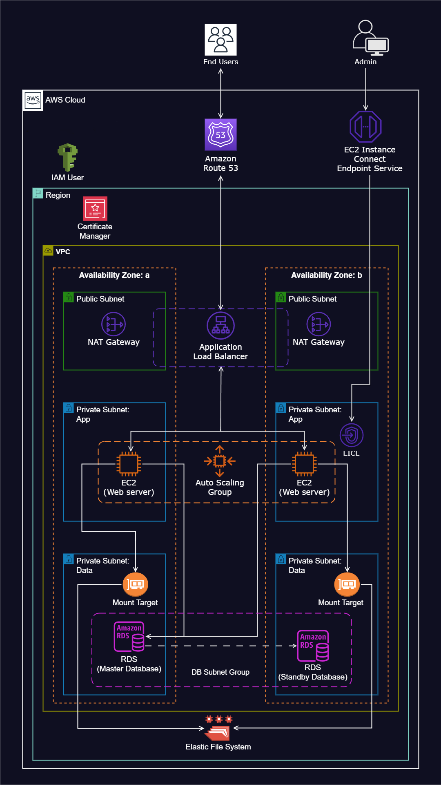

# Host a WordPress Website on AWS

## Project Overview

This project demonstrates how to host a WordPress website on AWS using various services to ensure scalability, availability, and security. The infrastructure utilizes a Virtual Private Cloud (VPC) with public and private subnets, Auto Scaling groups, and Amazon RDS for database management.

## Architecture Diagram




## Key Features

1. **VPC Configuration**: 
   - Configured a VPC with both public and private subnets across two different availability zones for enhanced availability and fault tolerance.
   
2. **Internet Gateway**: 
   - Deployed an Internet Gateway to enable connectivity between VPC instances and the internet.

3. **Security Groups**: 
   - Established Security Groups as a network firewall mechanism.

4. **High Availability**: 
   - Leveraged two Availability Zones to improve system reliability and fault tolerance.

5. **Infrastructure Components**: 
   - Utilized Public Subnets for components like the NAT Gateway and Application Load Balancer.

6. **Secure Connections**: 
   - Implemented EC2 Instance Connect Endpoint for secure connections to instances within both public and private subnets.

7. **Web Server Security**: 
   - Positioned web servers (EC2 instances) within Private Subnets for enhanced security.

8. **NAT Gateway**: 
   - Allowed instances in private Application and Data subnets to access the Internet via the NAT Gateway.

9. **WordPress Hosting**: 
   - Hosted the WordPress website on EC2 Instances.

10. **Load Balancing**: 
    - Employed an Application Load Balancer to evenly distribute web traffic to an Auto Scaling Group of EC2 instances across multiple Availability Zones.

11. **Auto Scaling**: 
    - Utilized Auto Scaling Groups to manage EC2 instances, ensuring availability, scalability, and elasticity.

12. **Version Control**: 
    - Stored web files on GitHub for version control and collaboration.

13. **SSL Management**: 
    - Secured application communications using AWS Certificate Manager.

14. **Monitoring and Notifications**: 
    - Configured Simple Notification Service (SNS) to alert about activities within the Auto Scaling Group.

15. **Domain Management**: 
    - Registered the domain name and set up a DNS record using Amazon Route 53.

16. **File Storage**: 
    - Used Amazon Elastic File System (EFS) for shared file storage.

17. **Database Management**: 
    - Utilized Amazon RDS for database management with master and standby databases.

## Deployment Scripts

### Script to Install WordPress on EC2 Instance

```bash
# create to root user
sudo su

# update the software packages on the ec2 instance
sudo yum update -y

# create an html directory
sudo mkdir -p /var/www/html

# environment variable
EFS_DNS_NAME=fs-064e9505819af10a4.efs.us-east-1.amazonaws.com

# mount the efs to the html directory
sudo mount -t nfs4 -o nfsvers=4.1,rsize=1048576,wsize=1048576,hard,timeo=600,retrans=2,noresvport "$EFS_DNS_NAME":/ /var/www/html

# install the apache web server, enable it to start on boot, and then start the server immediately
sudo yum install -y httpd
sudo systemctl enable httpd
sudo systemctl start httpd

# install php 8 along with several necessary extensions for WordPress to run
sudo dnf install -y php php-cli php-cgi php-curl php-mbstring php-gd php-mysqlnd php-gettext php-json php-xml php-fpm php-intl php-zip php-bcmath php-ctype php-fileinfo php-openssl php-pdo php-tokenizer

# install the mysql version 8 community repository
sudo wget https://dev.mysql.com/get/mysql80-community-release-el9-1.noarch.rpm

# install the mysql server
sudo dnf install -y mysql80-community-release-el9-1.noarch.rpm
sudo rpm --import https://repo.mysql.com/RPM-GPG-KEY-mysql-2023
sudo dnf repolist enabled | grep "mysql.*-community.*"
sudo dnf install -y mysql-community-server

# start and enable the mysql server
sudo systemctl start mysqld
sudo systemctl enable mysqld

# set permissions
sudo usermod -a -G apache ec2-user
sudo chown -R ec2-user:apache /var/www
sudo chmod 2775 /var/www && find /var/www -type d -exec sudo chmod 2775 {} \;
sudo find /var/www -type f -exec sudo chmod 0664 {} \;
chown apache:apache -R /var/www/html

# download wordpress files
wget https://wordpress.org/latest.tar.gz
tar -xzf latest.tar.gz
sudo cp -r wordpress/* /var/www/html/

# create the wp-config.php file
sudo cp /var/www/html/wp-config-sample.php /var/www/html/wp-config.php

# edit the wp-config.php file
sudo vi /var/www/html/wp-config.php

# restart the webserver
sudo service httpd restart
```

### Script for Auto Scaling Group Launch Template

```bash
#!/bin/bash
# update the software packages on the ec2 instance
sudo yum update -y

# install the apache web server, enable it to start on boot, and then start the server immediately
sudo yum install -y httpd
sudo systemctl enable httpd
sudo systemctl start httpd

# install php 8 along with several necessary extensions for WordPress to run
sudo dnf install -y php php-cli php-cgi php-curl php-mbstring php-gd php-mysqlnd php-gettext php-json php-xml php-fpm php-intl php-zip php-bcmath php-ctype php-fileinfo php-openssl php-pdo php-tokenizer

# install the mysql version 8 community repository
sudo wget https://dev.mysql.com/get/mysql80-community-release-el9-1.noarch.rpm

# install the mysql server
sudo dnf install -y mysql80-community-release-el9-1.noarch.rpm
sudo rpm --import https://repo.mysql.com/RPM-GPG-KEY-mysql-2023
sudo dnf repolist enabled | grep "mysql.*-community.*"
sudo dnf install -y mysql-community-server

# start and enable the mysql server
sudo systemctl start mysqld
sudo systemctl enable mysqld

# environment variable
EFS_DNS_NAME=fs-02d3268559aa2a318.efs.us-east-1.amazonaws.com

# mount the efs to the html directory
echo "$EFS_DNS_NAME:/ /var/www/html nfs4 nfsvers=4.1,rsize=1048576,wsize=1048576,hard,timeo=600,retrans=2 0 0" >> /etc/fstab
mount -a

# set permissions
chown apache:apache -R /var/www/html

# restart the webserver
sudo service httpd restart
```

## Conclusion

This project provides a comprehensive overview of hosting a WordPress website on AWS, emphasizing best practices for security, scalability, and reliability. It serves as a valuable resource for anyone looking to deploy web applications in a cloud environment.

